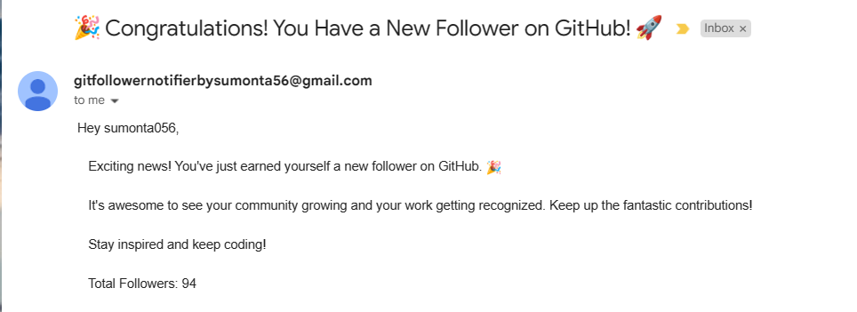

# 🤖 GitHub Follower Notification Action-Bot 🤖

------ **📚 Keep track of GitHub followers with automated notification bot 📚** ------

*Introducing the GitHub Follower Notification Action-Bot, your faithful companion in keeping track of your GitHub followers effortlessly. This innovative project brings the power of automation to your GitHub experience, ensuring you never miss a beat when it comes to engaging with your followers.*

### ✍️ **How it Looks : Feature - 1 (Daily Emails)**

### ✍️ **How it Looks : Feature - 2 (New Follower Special Email)**

### 🔃 More Features Coming Soon

# 🌱 How to configure for the project for your profile

### 1️⃣ Clone and Upload Repository

- **👉 Clone The Repository**

### 2️⃣ Setup Environment and Scret Variables

- **👉 Add Your Email Address**

- **👉 Add Your Email Password**

- **👉 (Don't Everything will be secure by Github)**

- **👉 Add Github Token API**

### 3️⃣ Modification in Code

- **👉 Change the Email Address in the Code**

- **👉 Change GitHub Username in the Code**
