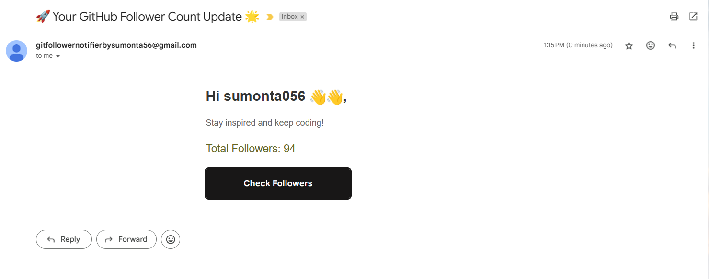
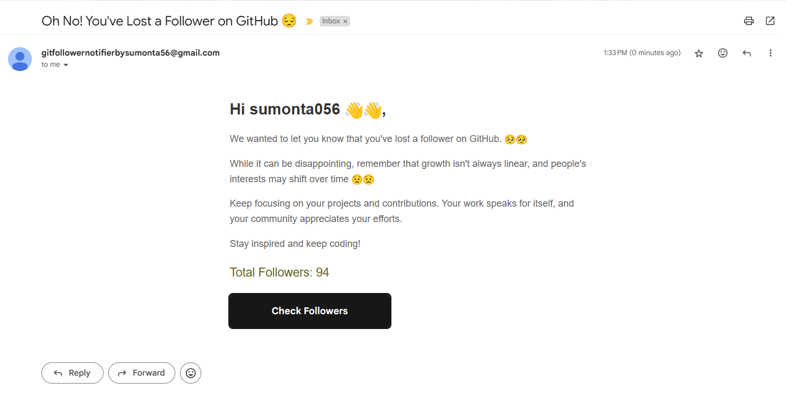
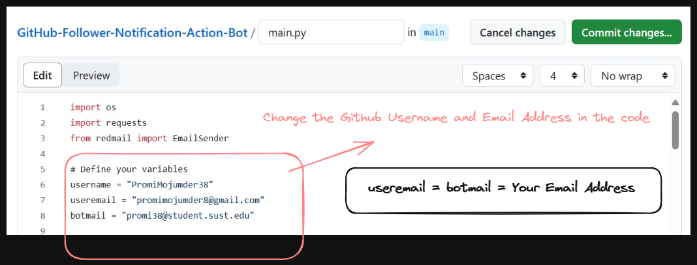
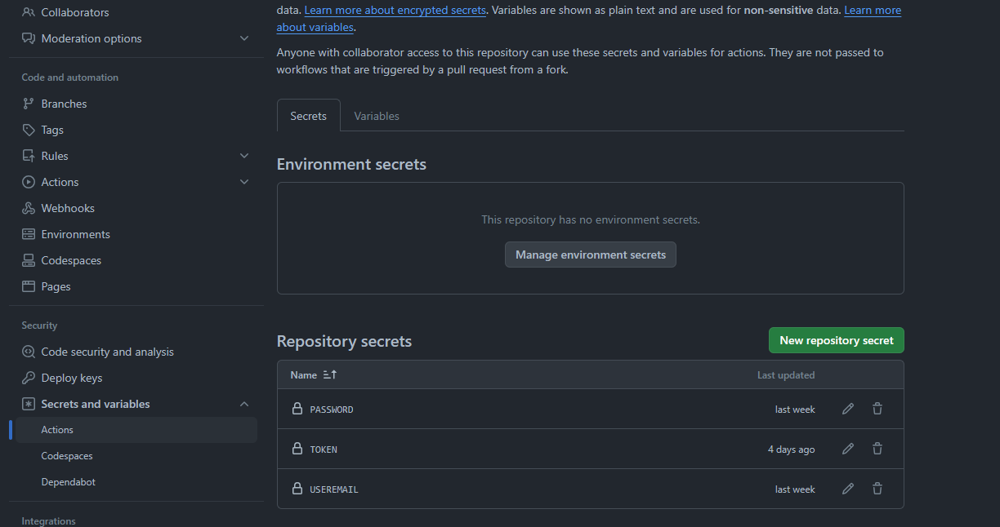

# 🤖 GitHub Follower Notification Action-Bot 🤖

------ **📚 Keep track of GitHub followers with automated notification bot 📚** ------

Introducing the GitHub Follower Notification Action-Bot, your faithful companion in keeping track of your GitHub followers effortlessly. This innovative project brings the power of automation to your GitHub experience, ensuring you never miss a beat when it comes to engaging with your followers.

### ✍️ **How it Looks : Feature - 1 (Daily Emails)**

### ✍️ **How it Looks : Feature - 2 (New Follower Special Email)**

### ✍️ **How it Looks : Feature - 3 (When Somebody Unfollows Special Email)**

### 🔃 More Features Coming Soon

------ **🔜 Followers Information (Who Follows or Unfollows) 🔜** ------

------ **🔜 More Information (If anyone start your repository) 🔜** ------

## 🌱 How to configure for the project for your profile

### 1️⃣ Step - 1 : Fork The Repository

### 2️⃣ Step - 2 : Click and Edit the main.py file ( Change Github Username and Email)

- **👉 Press the edit button to edit**
- **👉 Change the Github Username and Email Address in the code**
- **👉 useremail = botmail = Your Email Address**

  

### 3️⃣ Step - 3 : Need to Create Github Token (Follow The Tutorial)

- **👉 Note : Copy Token & Save it : You will this Token later on**

- **👉 Change the Expiration date while creating Token : Use 90 Days +**

https://github.com/Sumonta056/GitHub-Follower-Notification-Action-Bot/assets/61287791/23bbb751-fb2a-4ab9-b942-1f25f0731b45

### 4️⃣ Step - 4 : Need to Create a Special App Password using your email address so that bot can access it without breaking your privacy (Follow The Tutorial)

- **👉 Go To Your Google Account Setting : [Click Here 👍 ](https://myaccount.google.com/)**

https://github.com/Sumonta056/GitHub-Follower-Notification-Action-Bot/assets/61287791/bd8a1353-9c37-4114-8bd6-a13820fdab14

- **👉 Note : Copy Password, remove the empty space & Save it : You will this App Password later on**

### 5️⃣ Step - 5 : You need to add your email address, password and github-token in the project scecret variables (Don't Worry Everything will be secure by Github)

- **👉 Go to Project Setting -> Secrets and variables ->Actions**

- **👉 Now Need to Create This Secrets with you email , app password we generated earlier and Github Token (Follow The Tutorial)**

https://github.com/Sumonta056/GitHub-Follower-Notification-Action-Bot/assets/61287791/1aaa990e-cce4-4878-ab62-c1171c6a5d94

### 6️⃣ Step - 6 : Test The Project Setup

https://github.com/Sumonta056/GitHub-Follower-Notification-Action-Bot/assets/61287791/20153151-9962-4f8c-81d4-174eb50eef9f

## 7️⃣ Step - 7 : Congratulations ! You have successfully setup the project. Now you will daily get a follower message on your Email

