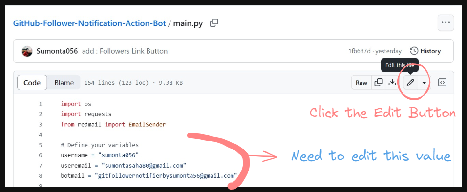

## Step - 1 : Fork The Repository

## Step - 2 : Click and Edit the main.py file ( Change Github Username and Email)

- **Press the edit button to edit**
- **Change the Github Username and Email Address in the code**
- **useremail = botmail = Your Email Address**

## Step - 3 : Need to Create Github Token (Follow The Tutorial)

## Step - 4 : Need to Create a Special App Password using your email address so that bot can access it without breaking your privacy
- **Note : Copy Password, remove the empty space & Save it : You will this App Password later on**

https://github.com/Sumonta056/GitHub-Follower-Notification-Action-Bot/assets/61287791/bd8a1353-9c37-4114-8bd6-a13820fdab14

## Step - 4 : You need add your email address, password and github-token in the project scecret variables
- **Press the edit button to edit**

## Step - 5 : Test The Project

## Step - 6 : Congratulations ! You have successfully setup the project. Now you will daily get a follower message on your Email

